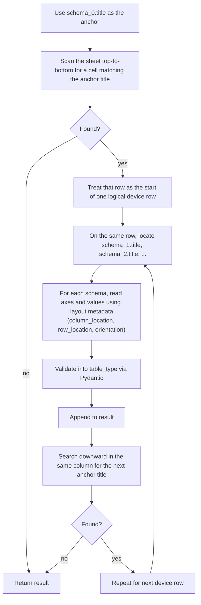

# How the reader works

This document explains how `read_sheet_bytes` locates and parses tables from an Excel sheet.
Understanding this helps when parsing fails or when you need to debug an unexpected result.

---

## The title-anchor approach

excel-table does not rely on hidden markers or fixed cell addresses.
It reads Excel based on visible structure: **title cells, axis labels, and merged cell spans**.

This means:

- Files can be opened, edited, and fixed manually without breaking the parser
- The parser is designed to make structural mismatches visible and easier to diagnose, rather than silently hiding errors behind fixed cell coordinates
- You can diagnose failures by looking at the Excel file directly

---

## Read algorithm

Given a `SheetReadSchema(columns=[schema_0, schema_1, ...])`:



---

## How each table type is located

### Table2D

1. Find the title cell
2. Read `column_label` from the merged cell immediately below (merge width = number of columns)
3. Read column headers from the row below that
4. Read `row_label` from the merged cell to the left of the value block (merge height = number of rows)
5. Read row headers and value cells

The merge span of `column_label` determines `len(column)`.
The merge span of `row_label` determines `len(row)`.
This is why `Table2D` requires at least 2 columns and 2 rows — a span of 1 is indistinguishable from a plain label cell.

### Table1D

Same as `Table2D` but single-axis. Orientation (`horizontal` / `vertical`) must match the schema.

### TableKeyValue

1. Find the title cell
2. Read the header row immediately below
3. Read the value row below that

No merge span logic — layout is always fixed.

---

## What can go wrong

### Title not found

```
KeyError: "IV Result"
```

The reader scanned the entire sheet and could not find a cell with that exact string.

**Check:**
- Spelling and case match exactly (`"IV Result"` ≠ `"iv result"`)
- No leading/trailing spaces in the cell
- The sheet name passed to `read_sheet_bytes` is correct

### Axis length mismatch

```
ValueError: values has 3 rows, expected 5 (len(row))
```

The parsed axis length does not match the value block.

**Check:**
- The merge span of `column_label` / `row_label` matches the actual number of axis values
- No extra blank columns or rows were inserted between the label and the value block

### Validation failure

```
pydantic.ValidationError: ...
```

The reader extracted the cells correctly, but `table_type` validation failed (e.g. a non-numeric string in a `Table2DFloat` value cell).

**Check:**
- Value cells contain the expected type
- Blank cells are intentional (`None` is allowed; other non-numeric strings are not)

### Wrong table picked up

The reader found the title but the data looks wrong — axis values or shape are unexpected.

**Check:**
- Title strings are unique within a row (duplicate titles in the same row are not supported)
- Ensure the anchor title appears only once per logical row
- `column_location` / `row_location` in the schema matches the actual layout written

---

## Multiple devices in one file

The reader returns `list[list[...]]` — one inner list per detected device row.

```
result[0]  → first device  (first occurrence of anchor title)
result[1]  → second device (next occurrence of anchor title, same column, further down)
...
```

Each device row must have the same table structure (same titles, same axis lengths).
The reader does not support variable-length axes across device rows.

---

## Debugging tips

1. **Open the file in Excel** and check titles, merge spans, and axis values visually
2. **Print the raw openpyxl cells** around the anchor title to see what the reader sees
3. **Use a minimal repro** — strip the file down to one device row and one table to isolate the failure
4. **Check `column_location` / `row_location`** — if these don't match the written layout, the reader computes wrong offsets and picks up wrong cells silently