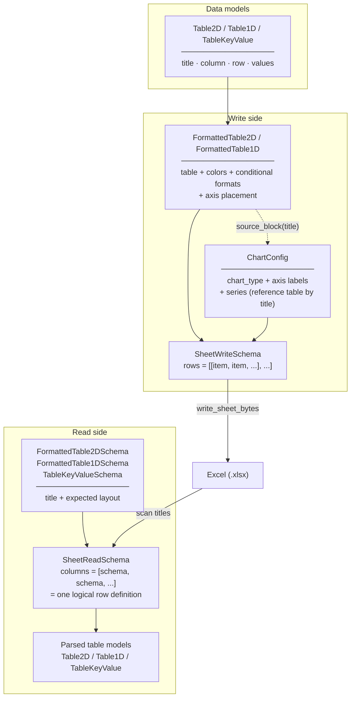
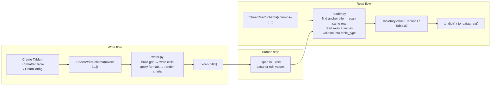

# excel-table

Structured Excel table read/write library for Python.

## Why excel-table?

Excel is the de facto data interface in many engineering and research environments.
Instruments export CSV or Excel. Analysis vendors deliver Excel. Stakeholders want Excel back.
Non-programmers enter data in Excel because that's what they know.

The format keeps changing. The reliance on Excel doesn't.

The typical response is to write openpyxl or xlsxwriter code that reaches into specific cells
by coordinate. It works until the format changes — then you rewrite it. Then the format changes
again.

The real problem is that **the format definition and the read/write logic are tangled together**.
Every format change requires a code change, not because the logic changed, but because nobody
separated the two.

excel-table separates them: **define the Excel↔code interface once as a Pydantic model, then
read and write against that model**. When the format changes, you update the model. The read/write
logic stays the same.

This means:

- No more rewriting cell-manipulation code every time a column shifts or a row is added
- Excel becomes a proper I/O interface, not a one-off script target
- Format changes are model changes — reviewable, diffable, version-controlled

**excel-table is particularly useful when:**

- You receive files from instruments or vendors with a fixed-but-evolving structure
- You need to give non-programmers a data entry interface (Excel) while keeping processing logic in Python
- Your team uses Excel as the common interface between code and stakeholders, and you're tired of
  rewriting the glue code every time the format shifts
- You want to generate formatted Excel reports with charts programmatically

---

## Installation

```bash
pip install excel-table
```

---

## Concepts

excel-table separates three concerns:

**Data models** — `Table2D`, `Table1D`, and `TableKeyValue` represent structured table data, independent of Excel rendering or parsing.

**Write-time rendering** — `FormattedTable2D` and `FormattedTable1D` wrap a data model with rendering metadata (colors, conditional formats, axis placement). `FormattedTable*` keeps the underlying table because Excel rendering and chart generation require the actual table shape — axes, value ranges, and cell positions. `ChartConfig` defines charts by referencing already-placed tables by title. `SheetWriteSchema` arranges these into a grid of rows.

**Read-time schema** — `FormattedTable2DSchema`, `FormattedTable1DSchema`, and `TableKeyValueSchema` describe the expected layout of each table in the sheet. `SheetReadSchema` defines one logical row of tables; the reader scans the sheet for repeated occurrences of that row pattern.

> **Note:** `SheetReadSchema.columns` does not refer to Excel columns. It defines the ordered table items in a single logical row.

excel-table does not rely on hidden markers or internal IDs. It reads Excel based on visible structure — titles, axis labels, and cell layout — so you can inspect, debug, and fix files manually when parsing fails.

### Conceptual model



### How read and write work



The reader locates tables by scanning for title cells. Titles must be unique within a row, and the layout must follow the schema definition.

If parsing fails:
- Check that title strings match exactly (including spaces and case)
- Check that axis lengths in the file match the written template
- Check that tables appear in the expected left-to-right order within a row

For a step-by-step explanation of the title-anchor algorithm and common failure modes, see [docs/parsing.md](docs/parsing.md).

---

## Write — blank input template

A common pattern: generate a blank Excel template with axes pre-filled, hand it to a user, let them paste in the data, then read it back.

```python
import numpy as np
from excel_table.models import Table2D, FormattedTable2D, TableKeyValue
from excel_table.writer import SheetWriteSchema, write_sheet_bytes

vgs = [-0.4, -0.2, 0.0, 0.2, 0.4, 0.6, 0.8, 1.0]
vds = [round(v * 0.01, 2) for v in range(101)]

# Key-value table for device parameters — values left blank for user input
model_params = TableKeyValue(
    title="Model Params",
    column=["GateWidth [um]", "GateLength [um]"],
    value=[None, None],
)

# 2-D grid with axes pre-filled, data cells blank
iv_table = FormattedTable2D(
    table=Table2D(
        title="IV Result",
        column_label="Vgs [V]",
        row_label="Vds [V]",
        column=vgs,
        row=vds,
        values=np.full((len(vds), len(vgs)), None).tolist(),
    )
)

schema = SheetWriteSchema(rows=[[model_params, iv_table]])
xlsx_bytes = write_sheet_bytes(sheet_name="Measurement", schema=schema)

# e.g. in Streamlit:
# st.download_button("Download template", xlsx_bytes, "template.xlsx")
```

The user opens the file, pastes their measured values into the blank cells, and returns it.

---

## Read — parse filled template

Define a schema that matches the layout written above, then parse the uploaded file:

```python
from excel_table.reader import SheetReadSchema, read_sheet_bytes
from excel_table.models import Table2DFloat
from excel_table.models.table_format import FormattedTable2DSchema, TableKeyValueSchema

schema = SheetReadSchema(
    columns=[
        TableKeyValueSchema(title="Model Params"),
        FormattedTable2DSchema(title="IV Result", table_type=Table2DFloat),
    ]
)

# data: raw .xlsx bytes from file upload or disk
result = read_sheet_bytes(data, "Measurement", schema)

# result is list[list[...]] — one inner list per detected row of tables
params      = result[0][0]  # TableKeyValue
iv          = result[0][1]  # Table2DFloat

# iv.column — Vgs axis values
# iv.row    — Vds axis values
# iv.values — Ids grid, shape [n_vds][n_vgs], values cast to float
```

`Table2DFloat` instructs the reader to cast all cell values to `float` during model validation. String axis labels (`"forward"`, `"backward"`) are supported alongside numeric axes.

The reader scans the sheet for repeated occurrences of the first schema item title (`"Model Params"`), so **multiple devices in one file** just work — `result` contains one inner list per device row.

### Working with parsed results

Once parsed, the table models can be converted directly to standard Python/scientific types:

```python
import numpy as np

# TableKeyValue → dict
params_dict = params.to_dict()
# {"GateWidth [um]": "100.0", "GateLength [um]": "1.0"}

W_um = float(params_dict["GateWidth [um]"])

# Table2DFloat → xarray.DataArray
# dtype=np.float64 converts None (blank cells) to np.nan
da = iv.to_dataarray(dtype=np.float64)
# da.dims              == ("row", "column")
# da.coords["row"]     == Vds axis
# da.coords["column"]  == Vgs axis
# da.attrs             == {"title": "IV Result", "row_label": "Vds [V]", "column_label": "Vgs [V]"}

# transpose if needed — dims follow
da.T  # dims == ("column", "row")
```

---

## Write — formatted report with charts

```python
from excel_table.models import (
    Table2D, FormattedTable2D, TableKeyValue,
    ColorScale, LineSeriesConfig, ChartConfig,
)
from excel_table.writer import SheetWriteSchema, write_sheet_bytes

jd_iv_table = FormattedTable2D(
    table=Table2D(
        title="Jd IV",
        column_label="Vgs [V]",
        row_label="Vds [V]",
        column=vgs,
        row=vds,
        values=jd_iv_values,
    ),
    # 3-color gradient applied to data cells
    value_conditional_formats=[
        {
            "type": "3_color_scale",
            "min_color": "#FFFFFF",
            "mid_color": "#FFF176",
            "max_color": "#FF5722",
        },
    ],
)

iv_chart = ChartConfig(
    chart_type="line",
    x_label="Vds [V]",
    y_label="Jd [mA/mm]",
    series=[
        LineSeriesConfig(
            label="Jd IV",
            source_block="Jd IV",   # references the table by title
            style="line",
            x_axis="row",
            color_axis="column",    # one series per Vgs value
            series_colorscale=ColorScale(
                min_color="#2196F3",
                mid_color="#4CAF50",
                max_color="#F44336",
            ),
        )
    ],
)

# Dual Y-axis chart: Jd on y1, gm on y2
transfer_chart = ChartConfig(
    chart_type="line",
    x_label="Vgs [V]",
    y_label="Jd [mA/mm]",
    y2_label="gm [mS/mm]",
    series=[
        LineSeriesConfig(
            label="Jd forward",
            source_block="Jd Transfer",
            style="line",
            x_axis="row",
            col_filter="column == 'forward'",
        ),
        LineSeriesConfig(
            label="gm forward",
            source_block="gm",
            style="line",
            x_axis="row",
            col_filter="column == 'forward'",
            y_axis="y2",            # secondary Y axis
        ),
    ],
)

schema = SheetWriteSchema(rows=[[
    model_params, jd_iv_table, jd_tr_table, gm_table, iv_chart, transfer_chart
]])
xlsx_bytes = write_sheet_bytes(sheet_name="Report", schema=schema)
```

`ChartConfig` references tables by `title` via `source_block`. Multiple series can reference the same table — use `col_filter` or `row_filter` to select subsets (e.g. `"column == 'forward'"`).

---

## Demo

You can try the full workflow in the demo app:

https://excel-table-demo.streamlit.app/

The source code for the demo is available here:

https://github.com/hiroshiasayadev-prog/excel-table-demo

The demo uses a GaAs HEMT transistor simulator as a stand-in for real instrument output, covering:

- Page 1: Simulate measurements, download CSV
- Page 2: Generate blank Excel input template (excel-table **write**)
- Page 3: Paste CSV values into the template manually
- Page 4: Upload filled template, parse with excel-table (excel-table **read**)
- Page 5: Export formatted report with charts (excel-table **write**)

---

## License

MIT